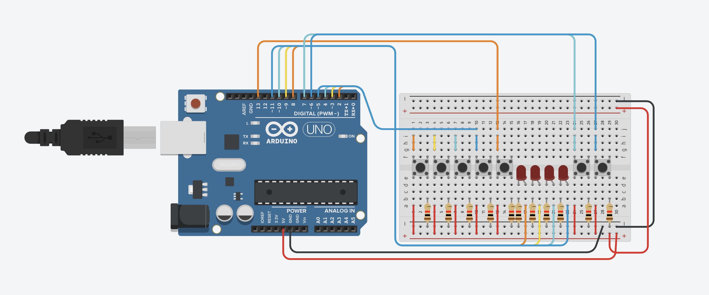

# 🧠 4-Bit Arduino Processor

A simple **4-bit processor built with Arduino** that performs basic arithmetic operations like **addition** and **multiplication**. It uses binary inputs and displays results in real time using LEDs.

---

## 📸 Circuit Diagrams

<table>
  <tr>
    <td align="center"><b>Digital Circuit</b></td>
    <td align="center"><b>RI Circuit</b></td>
  </tr>
  <tr>
    <td></td>
    <td></td>
  </tr>
</table>

---

## ✨ Features

- Performs **addition and multiplication** of two 4-bit binary numbers  
- Displays results in **binary format using LEDs**  
- Controlled using a **clock button** for input and operation phases  
- **Handles overflow** automatically (limited to 4 bits)

---

## ⚙️ How It Works

### 🔢 Input Phase
1. Use toggle switches to set the first binary number (Reg A)
2. Press the **clock button** to store this number in Reg A
3. Set the second binary number (Reg B)
4. Press the **clock button** again to store this number in Reg B

### ➕ Operation Phase
- Press the **"Add" button** to perform addition  
- Press the **"Multiply" button** to perform multiplication  
- The processor calculates the result

### 💡 Output Phase
- Result is displayed in **binary format on 4 LEDs**

---

## 💡 Example

| Register A | Register B | Operation | Result (Binary) | Result (Decimal) |
|------------|------------|-----------|------------------|------------------|
| `0011`     | `0101`     | Add       | `1000`           | `8`              |
| `0011`     | `0101`     | Multiply  | `1111`           | `15`             |

---

## 🛠 Troubleshooting

- 🔌 **LEDs not lighting up?** — Check wiring and resistor placement  
- 🔁 **Incorrect results?** — Double-check input switches  
- 🔘 **Buttons unresponsive?** — Inspect connections or replace faulty components